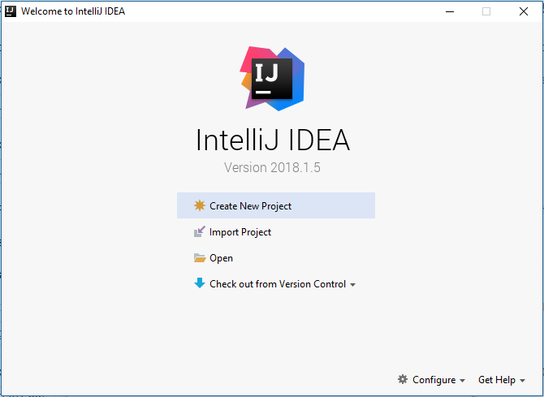

# QualityExcites2018
Repository contains base project which will be used during workshops "Best practices for creating Selenium tests using Cucumber".
# Environment setup
To be well prepared for the workshops there is need to setup environment in which we will be working. It's quite easy, but steps list might look a little bit scary. Don't worry, all will be described in details. In case of any problem you can email me - maciej.lorenc[at]gmail.com :) 
1. Install JDK
1. Install maven
1. Install docker
1. Install VNC viewer
1. Run selenium hub and node images
1. Install git
1. Install IntelliJ Idea
1. Import project from github
1. Add project as a maven project in IDE
1. Run sample test and check if it's working
#### Installing JDK
If you have JDK already installed you can skip this part, but please make sure that you have at least java 1.8. You can do this bym opening cmd and typing ``java --version``:
```
λ java --version
java 10.0.1 2018-04-17
Java(TM) SE Runtime Environment 18.3 (build 10.0.1+10)
Java HotSpot(TM) 64-Bit Server VM 18.3 (build 10.0.1+10, mixed mode)
```
Please check number in the first line of response.

You can follow instructions from [this video](https://www.youtube.com/watch?v=74pE3kLerAU).
Link to installer download page - [click](http://www.oracle.com/technetwork/java/javase/downloads/jdk10-downloads-4416644.html).
#### Installing maven
If you have maven already installed you can skip this part, but please make sure that you have at least maven 3.3.9. You can do this bym opening cmd and typing ``mvn --version``:
```
λ mvn --version
Apache Maven 3.5.3 (3383c37e1f9e9b3bc3df5050c29c8aff9f295297; 2018-02-24T20:49:05+01:00)
Maven home: C:\apache-maven-3.5.3\bin\..
Java version: 10.0.1, vendor: Oracle Corporation
Java home: C:\Program Files\Java\jdk-10.0.1
Default locale: pl_PL, platform encoding: Cp1250
OS name: "windows 10", version: "10.0", arch: "amd64", family: "windows"
```
You can follow instructions from [this video](https://www.youtube.com/watch?v=vUe4r9250c8).
Link to installer download page - [click](https://maven.apache.org/download.cgi).
#### Installing docker
We'll use docker to setup test run environment (selenium grid and node). Please follow [this instruction](https://docs.docker.com/docker-for-windows/install/#about-windows-containers).
#### Installing VNC viewer
If you are familiarized with any of VNC viewers please use your favorite one. If not I suggest to install [TightVNC](https://www.tightvnc.com/download.php). During installation choose to install only Viewer, we won't need a server.
#### Run selenium hub and node images
Open command line (click start menu and type cmd) and run following commands:
```
docker network create grid
docker run -d -p 4444:4444 --net grid --restart=always --name selenium-hub selenium/hub:3.12.0-cobalt
docker run -d -p 5900:5900 --net grid -e HUB_HOST=selenium-hub --shm-size 2g --restart=always --name selenium-node selenium/node-firefox-debug:3.12.0-cobalt
```
If everything is ok you can try to connect via VNC to node. Use ``localhost::5900`` as address and ``secret`` as a password. If everything is ok you should see node's desktop.
Connection screen with TightVNC Viewer:


Node desktop:

#### Installing git
Open [git download page](https://git-scm.com/downloads), download installer and run it. Follow installers instructions. If git is correctly installed then after putting ``git --version`` you should see something like this:
```
λ git --version
git version 2.17.1.windows.2
```
#### Installing IntelliJ IDEA
Go to [download page](https://www.jetbrains.com/idea/download/#section=windows), select proper installer (choose Community version) and follow installer instructions.
#### Importing and configuring project
Run IntelliJ IDEA. On home screen select ``Check out from version control`` and then select git:


When you will be asked for repository url add enter ``git@github.com:maclor/QualityExcites2018.git``.
